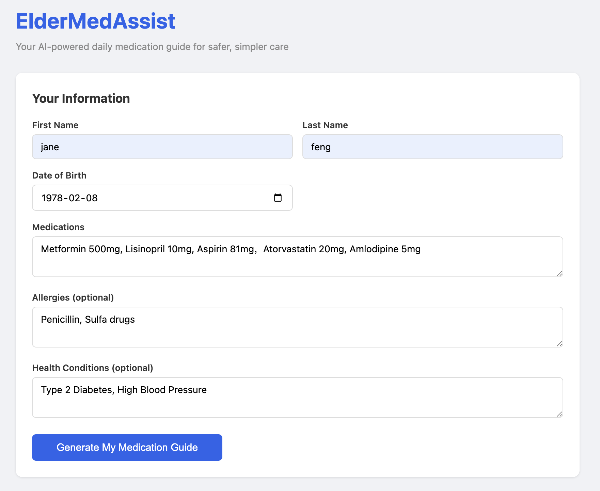
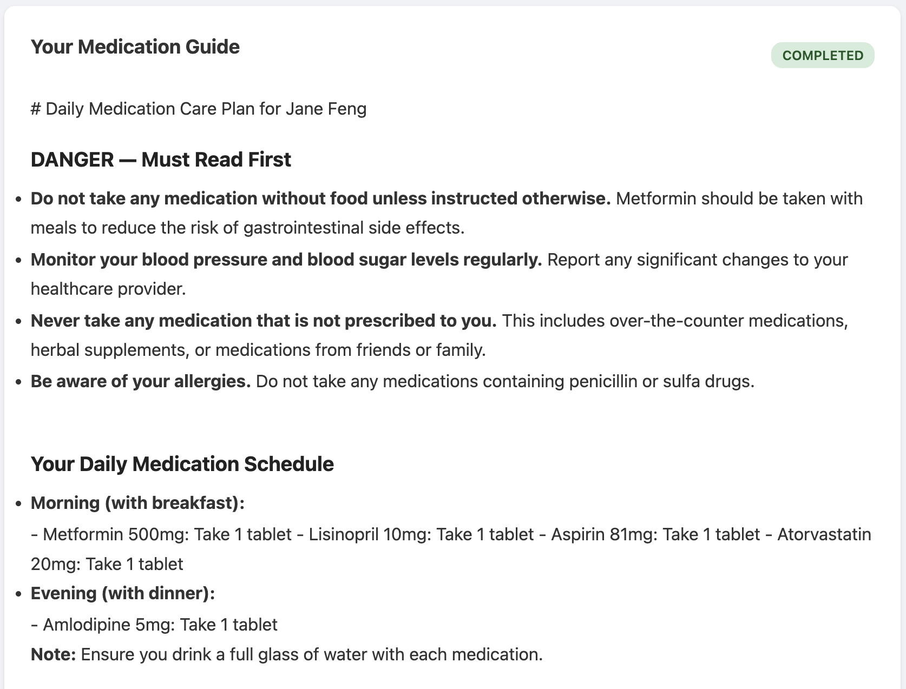
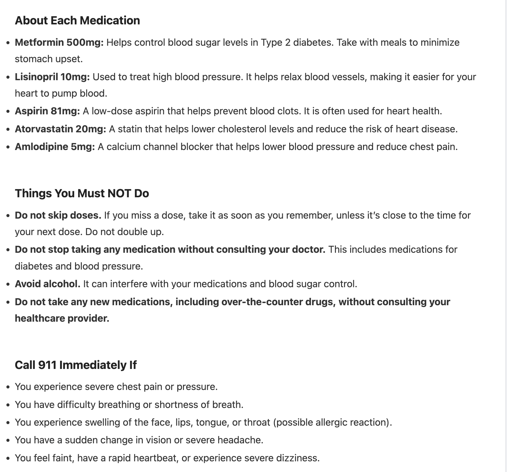

# ElderMedAssist

AI-powered daily medication guide for elderly patients. Enter patient info, get a personalized care plan with drug interactions, dosage schedules, and emergency warnings — generated by LLM in real time.

## Demo

**Patient Input Form**



**Generated Medication Guide**




## Architecture

```
┌─────────────┐     ┌─────────────┐     ┌─────────────┐
│   S3        │     │ API Gateway │     │   RDS       │
│  (Frontend) │────▶│  (HTTP API) │────▶│ (PostgreSQL)│
└─────────────┘     └──────┬──────┘     └──────▲──────┘
                           │                   │
                    ┌──────▼──────┐             │
                    │  Lambda 1   │             │
                    │ Create Order│─────────────┘
                    └──────┬──────┘
                           │ SQS message
                    ┌──────▼──────┐     ┌─────────────┐
                    │    SQS      │────▶│  Lambda 2   │
                    │   (Queue)   │     │ Generate    │
                    └─────────────┘     │ Care Plan   │
                                        └──────┬──────┘
                                               │
                                        ┌──────▼──────┐
                                        │    LLM      │
                                        │  (OpenAI)   │
                                        └─────────────┘

Lambda 3 (Get Order) ◀── API Gateway ◀── Frontend (polling)
```

**Request Flow:**
1. User submits patient info → **API Gateway** routes to **Lambda 1**
2. Lambda 1 validates input, saves to **RDS**, sends message to **SQS**
3. SQS triggers **Lambda 2**, which calls the **LLM** and writes the care plan back to RDS
4. Frontend polls **Lambda 3** via API Gateway until status becomes `completed`

## Tech Stack

| Category | Technology | Purpose |
|----------|-----------|---------|
| Frontend | HTML, CSS, JavaScript | User interface (hosted on S3) |
| Backend | Python, AWS Lambda | Serverless API handlers |
| Database | PostgreSQL (AWS RDS) | Persistent data storage |
| Queue | AWS SQS + DLQ | Async task processing with retry |
| AI/LLM | OpenAI API (GPT-4o-mini) | Care plan generation |
| API Layer | AWS API Gateway (HTTP) | REST endpoint routing |
| Infrastructure | Terraform | Infrastructure as Code |
| Monitoring | AWS CloudWatch | Lambda logs and error tracking |

## Local Development Stack

This project was originally built with a local development stack before migrating to AWS:

| Category | Technology | Purpose |
|----------|-----------|---------|
| Backend | Django, Django REST Framework | Web framework, API development |
| Async Tasks | Celery, Redis | Background task processing |
| Database | PostgreSQL | Local data storage |
| Containerization | Docker, Docker Compose | Local development environment |
| Testing | pytest | Unit and integration tests |
| Monitoring | Prometheus, Grafana | Metrics collection, visualization |

## Project Structure

```
ElderMedAssist/
├── lambdas/                  # AWS Lambda functions
│   ├── create_order.py       # POST /orders — validate, save, queue
│   ├── generate_careplan.py  # SQS-triggered — call LLM, update DB
│   ├── get_order.py          # GET /orders/{id} — query status
│   ├── db.py                 # Shared database connection utility
│   ├── init_tables.sql       # Database schema
│   └── zips/                 # Deployment packages
├── frontend/
│   └── index.html            # S3-hosted frontend
├── terraform/
│   └── main.tf               # All AWS infrastructure definitions
├── careplan/                 # Original Django application
│   ├── models.py
│   ├── views.py
│   ├── services.py
│   └── serializers.py
└── requirements.txt
```

## Deployment

All infrastructure is managed by Terraform — one command to deploy, one command to tear down.

```bash
cd terraform
terraform init
terraform apply        # Deploy all resources
terraform destroy      # Remove all resources (stops billing)
```

After `terraform apply`, initialize the database:

```bash
psql -h <rds_address> -U careplan_user -d careplan -f lambdas/init_tables.sql
```

## API Endpoints

| Method | Path | Description |
|--------|------|-------------|
| POST | `/orders` | Submit patient info, create care plan order |
| GET | `/orders/{id}` | Query care plan status and content |
